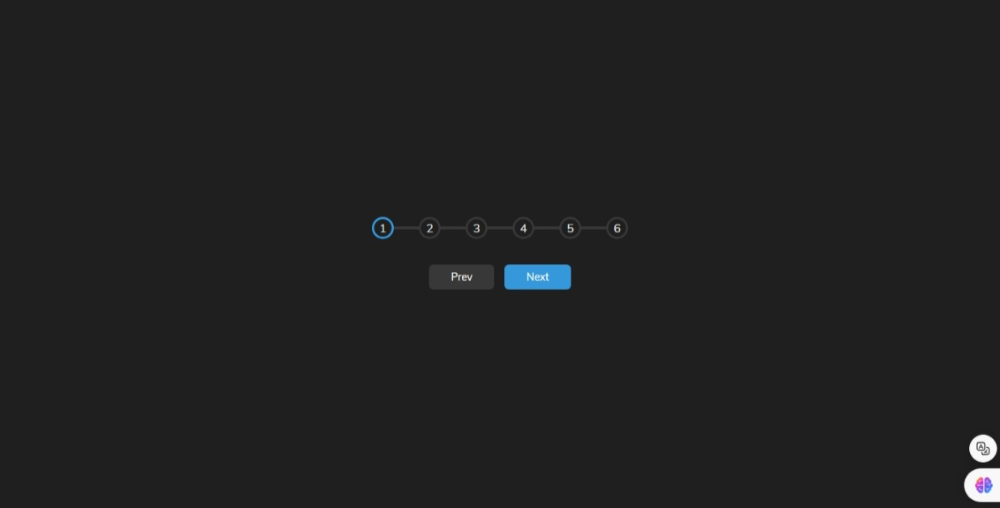

# Simple_Js_Tasks-4

## "Progress Steps"

This project implements a simple progress steps indicator using HTML, CSS, and JavaScript. It allows users to navigate through steps and visualize their progress with a dynamic progress bar.

## Demo

You can see a live demo of the project [here](#).

## Screenshots



## Features

- Step-by-step progress indicator.
- Navigation buttons for moving forward and backward through steps.
- Responsive design with CSS Flexbox for layout.

## Usage

To use this project, simply include the provided HTML, CSS, and JavaScript files in your project directory. Customize the styles and steps as needed.

```html
<!DOCTYPE html>
<html lang="en">
<head>
  <meta charset="UTF-8" />
  <meta name="viewport" content="width=device-width, initial-scale=1.0" />
  <title>Progress Steps</title>
  <link rel="stylesheet" href="styles.css">
</head>
<body>
  <div class="container">
    <div class="progress-container">
      <div class="progress" id="progress"></div>
      <div class="circle active">1</div>
      <div class="circle">2</div>
      <div class="circle">3</div>
      <div class="circle">4</div>
      <div class="circle">5</div>
      <div class="circle">6</div>
    </div>

    <button class="btn" id="prev" disabled>Prev</button>
    <button class="btn" id="next">Next</button>
  </div>
  <script src="script.js"></script>
</body>
</html>
